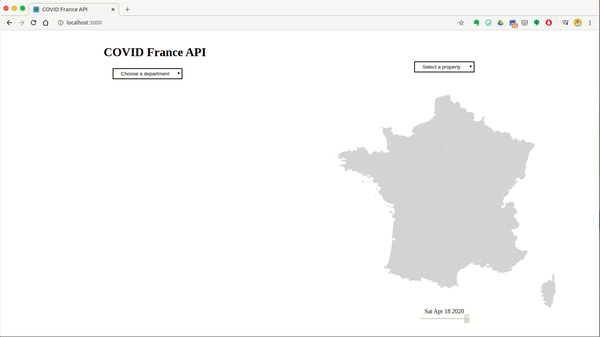

### <a target='_blank' href='covidfranceapi.herokuapp.com'>Check it live</a>

### Demo

### Api

go to <a href='covidfranceapi.herokuapp/graphql'>Graphiql</a> interface to play with the different schema I've implemented.

### Feedback

I'm only learning (it's my first graphql API) so please send me your feedback.

### Tech

- React (CRA, Hooks)
- Node + Express
- Graphql
- D3js
